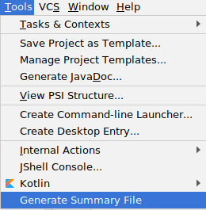

# Gitbooks Summary Generator

Hosted on [GitHub](https://github.com/askaFed/gitbooks-summary-generator)

A plug-in for JetBrains' IntelliJ IDEA which generates SUMMARY.md file for GitBooks based on your project structure.

## Use

Once installed, a new Generate Summary option became available under Tools menu.

### Rules

All directories containing markdown files are shown as sections in a summary file.

All markdown files are shown as normal links within theirs parent sections.

All not-markdown files and directories which don't contain any markdown file are ignored.

### Example
Example of directory tree:

Generated output file is placed in the project's root directory:

    # Summary
    
    * chapter1
    	* [1](chapter1/1.md)
    * chapter2
    	* [1](chapter2/1.md)
    	* [2](chapter2/2.md)
    * chapter3
    	* [1](chapter3/1.md)
    	* [2](chapter3/2.md)
    	* [3](chapter3/3.md)
    * chapter4
    	* [1](chapter4/1.md)
    	* [2](chapter4/2.md)

## Configuration

TBD - Configuration will be available under the *Settings* dialogue. 

## Development

The pre-requisites for the plugin are Git and JDK 1.11.x. Make sure your `JAVA_HOME`
environment variable is set correctly before invoking Gradle.

    git clone https://github.com/askaFed/gitbooks-summary-generator
    cd gitbooks-summary-generator

You can then easily build via Gradle:

    ./gradlew clean build

To run it in a sandboxed IDEA, run:

    ./gradlew runIdea

To debug the plugin, import the plugin into IDEA as a Gradle project, and then use the `runIdea` Gradle target in debug
mode. 

## Feedback

Any comments or bug reports are most welcome - please visit
the project on [GitHub](https://github.com/askaFed/gitbooks-summary-generator).

## Licence

Released under a [GNU GPL](https://www.gnu.org/licenses/gpl-3.0.en.html) licence.
